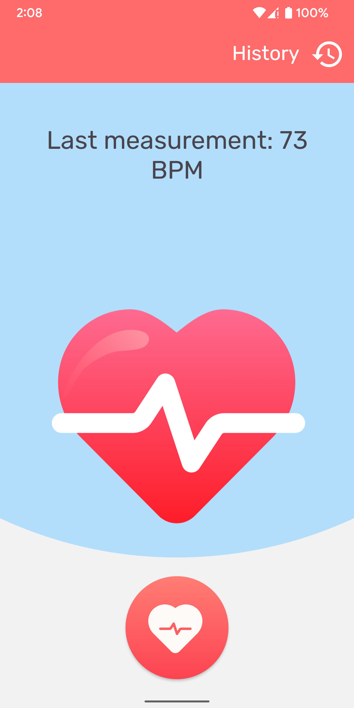
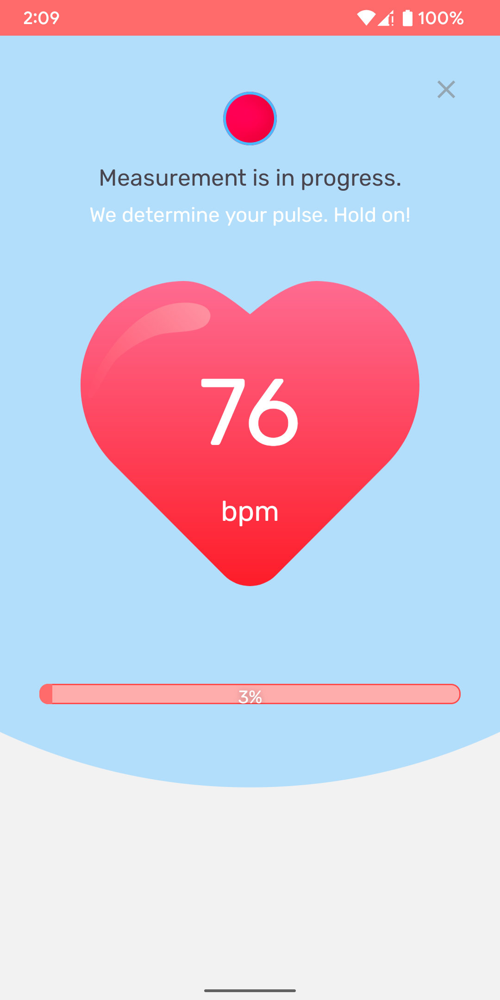
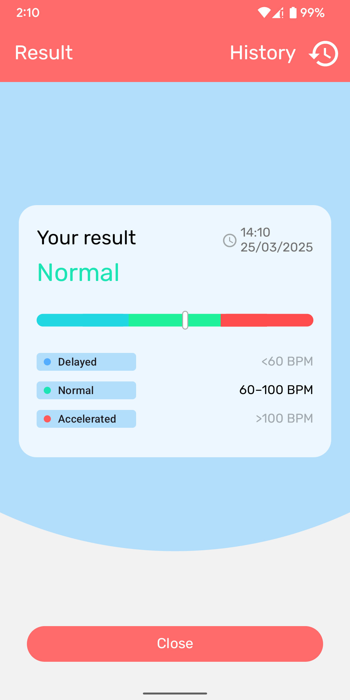
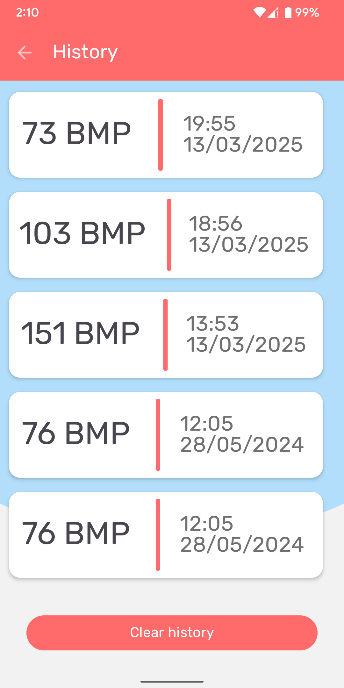

# Description
An Android application that can measure heart rate and save measurements locally. Thanks [MirzaAhmedBaig](https://github.com/MirzaAhmedBaig/CameraHeartMonitor) for measurement logic. 
# How to use
I recommend use smartphone where flashlight placed near of camera (like in Google Pixel 3) for it can shine through finger nice.
1. Open app and press on big round button placed in bottom for start measuring process.
2. Place a finger (for example, pointing finger) on a smartphone's camera in such the way that a flashlight shines through the finger. The finger should close the camera fully.
3. Hold the finger while the app measures heart rate.
4. See result on a result screen. Also, you can see results history in history section.
# Screenshots

